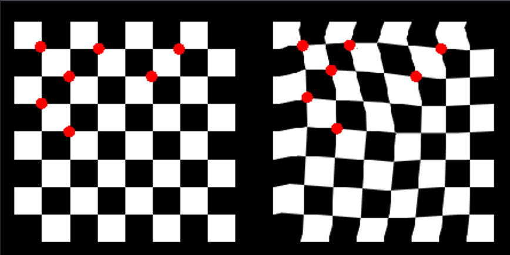

# AstMarker

[[Командный репозиторий](https://github.com/vchkz/astmarker)] | [[Личный репозиторий](https://github.com/lopatkinanton/misis2023f-22-01-lopatkin-a-a)]
## Описание проекта 
AstMarker - программа с пользовательским интерфейсом для полуавтоматической разметки соответствующих пар точек на двух картинках, которые являются разными развертками одного 3д-объекта. 
Пример разметки точек приведен на картинке ниже: первое изображение - идеальная развертка, второе - искаженная.

Программа помогает размечать точки автоматически. После отметки точки на одной картинке алгоритм пересчета координат "предскажет" расположение соответствующей точки на другой картинке. Пользователь может уточнить положение точки после "предсказания".
Также программа позволяет накладывать картинки друг на друга по размеченным точкам и рассчитывать значения функций ошибок искажения.

## Описание индивидуальной задачи
Разработка библиотеки "Asterisms" для работы с созвездиями, в которой реализованы: 
- добавление точек в созвездие;
- перемещение точек в созвездии;
- удаление точек из созвездия;
- загрузка точек из текстового файла;
- сохранение точек в текстовый файл;
- функция "предсказания" парной точки.

Созвездие представляет собой устойчивую конфигурацию точек на плоскости. Точки разбивают плоскость на треугольники в соответствии с триангуляцией Делоне.
Алгоритм вычисления координат парной точки основывается на интерполяции по вершинам треугольника, внутри которого лежит вновь отмеченная точка. 
На картинках ниже красным цветом показана триангуляция размеченных точек. На левой картинке зеленым цветом обозначена вновь отмеченная точка, синим - треугольник, в котором она лежит. На правой картинке синим цветом обозначен соответствующий треугольник в другом созвездии, и зеленым - результат интерполяции.

